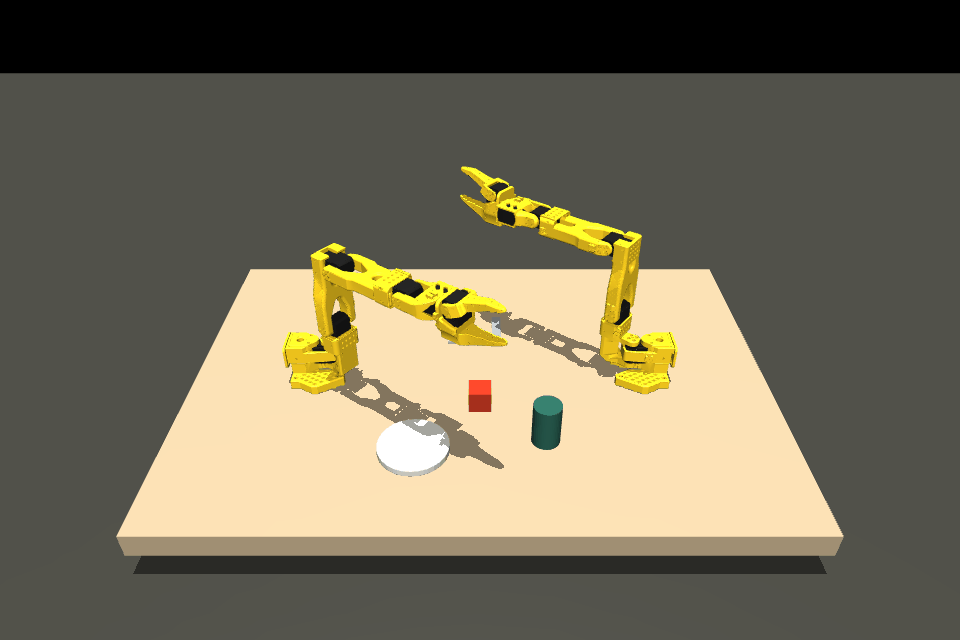
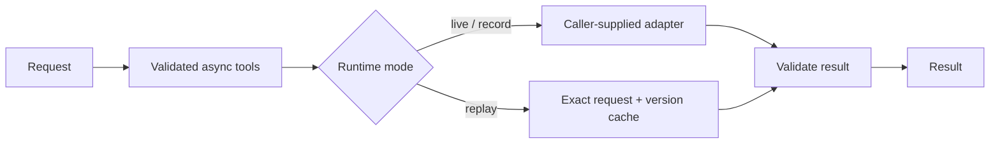

# Infra Summit · LineProof (provisional)

Proposed: two simulated SO-101 arms set a dinner table through a learned ACT policy
and camera/instruction reasoning, with stale-action rejection and visual verification.
See the [product requirements](docs/PRD.md).

**Current state: local physics prototype and CPU runtime preflight.** Two simulated
SO-101 arms render and perform scripted motion on Windows. Stop/reset and input
validation are tested. A random-weight ACT model runs natively and through OpenVINO.
Scripted single-arm cube manipulation now has recorded contact evidence. There is
no learned task policy or full dinner-table workflow.



**Latest:** [contact-based lift, carry and placement](docs/CONTACT_EXPERIMENT.md).
Six of ten small cube perturbations passed the scripted scorer; four failed.
This is not the required learned full-task evaluation.

[Reproduce the experiment](docs/LOCAL_FEASIBILITY.md) · [Measured results](BENCHMARKS.md)

The official brief calls for a full multi-step dinner-table task and ten randomized
seeds. Later [track guidance permits older Intel deployment](docs/DEPLOYMENT_FALLBACK.md),
explicitly naming an i7 CPU/iGPU as an alternative to the PDF's Core Ultra Series 2/3
target. We therefore have a documented Intel laptop fallback; the exact i5 model
was not individually named in that guidance. Learned policy execution is still required.

**G1 remains unresolved** on an executable full-task scene/data/policy
path. SO-101 geometry and LeRobot ACT now have local execution evidence. The full
Studio training stack and SmolVLM2 reasoning are still untested. No task training
has run and the learned-baseline/complete-system gates remain unpassed.
See [sources, resource budget and next steps](docs/FEASIBILITY.md).

## Run in three commands

Foundation checks require Python 3.11+ and no dependencies or credentials.
The optional simulator and policy preflight use Python 3.12 and separate dependency
locks; see [local setup](docs/LOCAL_FEASIBILITY.md).

```sh
git clone https://github.com/IZAQ18/infra-summit.git
cd infra-summit
python status.py
```

Run checks: `python -m unittest discover -s tests -v`.

## Implemented foundation



Runtime supports bounded async calls, opt-in safe retries, metadata-only traces,
explicit sanitized recording, offline replay and ordered provider fallback.
No LLM service is configured. See `agent_core/runtime.py`.

## Evidence

| Measurement | Result |
|---|---|
| Local simulation | 12 actuators, two cameras, scripted motion; stop/reset checks pass |
| Local OpenVINO | ACT random-weight CPU conversion and numerical parity tested |
| Learned task success | Not demonstrated |
| Scripted cube contact trial | Verified carry and release; 6/10 small perturbations passed |
| Core Ultra benchmark | Not run; later track guidance allows older Intel deployment |

See [BENCHMARKS.md](BENCHMARKS.md) for the required evidence protocol.
The recording above is a physics smoke test. No application demo or submission video exists.

## Next slice

Validate contact-based grasp/release and a full-task demonstration source before a
bounded learned-policy pilot. Use the documented Intel laptop deployment fallback;
an optional NVIDIA desktop can support training after its CUDA preflight passes.
Scripted motion and random-weight runtime checks are not the dinner-table submission.

Built by [IZAQ18](https://github.com/IZAQ18) · 2026 · MIT
