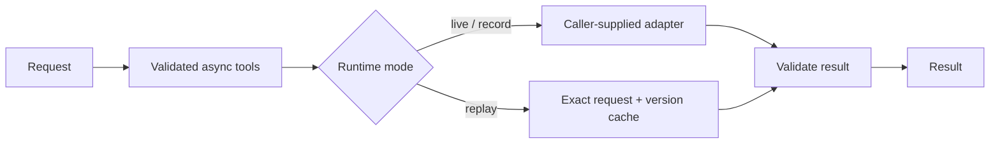

# Infra Summit · LineProof (provisional)

Proposed: two simulated robot arms complete one manipulation job, reject actions
based on stale observations, and verify the outcome. See the [product requirements](docs/PRD.md).

**Current state: foundation scaffold.** The shared tool runtime and its tests work.
There is no hardware adapter, model benchmark, dashboard or deployed demo yet.
LineProof must pass track-access, pretrained-baseline and observe-act-verify
feasibility gates before implementation. The full online requirements are not yet
confirmed. Loadout remains a possible alternative subject to its own eligibility checks.

**Feasibility checkpoint:** G1 is blocked on the official task/starter/model and
usable required resources. G2/G3 have not started. See [the evidence and unblock conditions](docs/FEASIBILITY.md).

## Run in three commands

Requires Python 3.11+; no dependencies or credentials needed for these checks.

```sh
git clone https://github.com/IZAQ18/infra-summit.git
cd infra-summit
python status.py
```

Run checks: `python -m unittest discover -s tests -v`.

## Implemented foundation



Runtime supports bounded async calls, opt-in safe retries, metadata-only traces,
explicit sanitized recording, offline replay and ordered provider fallback.
No LLM service is configured. See `agent_core/runtime.py`.

## Evidence

| Measurement | Result |
|---|---|
| Device latency | Not measured |
| Model accuracy | Not measured |
| Sponsor job | Not run |

See [BENCHMARKS.md](BENCHMARKS.md) for the required evidence protocol.
Hero screenshot, demo URL and video: pending a working application.

## Next slice

Confirm the full online track and free resources; run its compatible pretrained
baseline; then record one real observe-act-verify cycle. Continue LineProof only
if those gates pass. See [the PRD](docs/PRD.md) for requirements and proposed tests.

Built by [IZAQ18](https://github.com/IZAQ18) · 2026 · MIT
