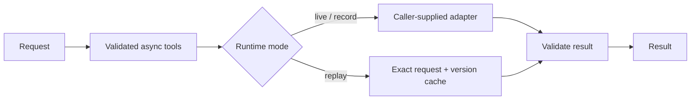

# Infra Summit · Loadout (provisional)

Planned: compare measured model deployments against a latency and accuracy budget.

**Current state: foundation scaffold.** The shared tool runtime and its tests work.
There is no hardware adapter, model benchmark, dashboard or deployed demo yet.
Loadout remains provisional until the full sponsor challenge confirms remote eligibility.

## Run in three commands

Requires Python 3.11+; no dependencies or credentials needed for these checks.

```sh
git clone https://github.com/IZAQ18/infra-summit.git
cd infra-summit
python status.py
```

Run checks: `python -m unittest discover -s tests -v`.

## Implemented foundation



Runtime supports bounded async calls, opt-in safe retries, metadata-only traces,
explicit sanitized recording, offline replay and ordered provider fallback.
No LLM service is configured. See `agent_core/runtime.py`.

## Evidence

| Measurement | Result |
|---|---|
| Device latency | Not measured |
| Model accuracy | Not measured |
| Sponsor job | Not run |

See [BENCHMARKS.md](BENCHMARKS.md) for the required evidence protocol.
Hero screenshot, demo URL and video: pending a working application.

## Next slice

Confirm track requirements; choose one supported model and one available sponsor
target; record a real compile/profile result; validate its metrics and provenance.
Cross-device comparisons and a deployment manifest follow that first result.

Built by [IZAQ18](https://github.com/IZAQ18) · 2026 · MIT
