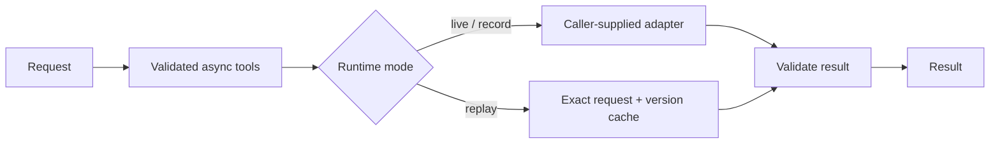

# Infra Summit · LineProof (provisional)

Proposed: two simulated SO-101 arms set a dinner table through a learned ACT policy
and camera/instruction reasoning, with stale-action rejection and visual verification.
See the [product requirements](docs/PRD.md).

**Current state: foundation scaffold.** No robotics policy, simulator integration,
model benchmark, dashboard or deployed demo has been executed.

The official brief is now resolved: a full multi-step dinner-table task, 10 randomized
seeds, and final MuJoCo/AI inference and benchmarking on Core Ultra Series 2/3 are required.
ACT is an allowed policy option; an organizer-supplied pretrained starter is not required.
The local i5 laptop does not satisfy the final hardware requirement.

**G1 remains unresolved** on usable mandatory compute and an executable scene/data/policy
path. The concrete candidate is upstream SO-101 MJCF + Studio ACT/LeRobot data + SmolVLM2-256M
reasoning, with a bounded task-training pilot still unexecuted. G2/G3 have not started.
See [sources, resource budget and next steps](docs/FEASIBILITY.md).

## Run in three commands

Foundation checks require Python 3.11+ and no dependencies or credentials.
The proposed robotics stack separately requires Python 3.12; see FEASIBILITY.md.

```sh
git clone https://github.com/IZAQ18/infra-summit.git
cd infra-summit
python status.py
```

Run checks: `python -m unittest discover -s tests -v`.

## Implemented foundation



Runtime supports bounded async calls, opt-in safe retries, metadata-only traces,
explicit sanitized recording, offline replay and ordered provider fallback.
No LLM service is configured. See `agent_core/runtime.py`.

## Evidence

| Measurement | Result |
|---|---|
| Device latency | Not measured |
| Model accuracy | Not measured |
| Sponsor job | Not run |

See [BENCHMARKS.md](BENCHMARKS.md) for the required evidence protocol.
Hero screenshot, demo URL and video: pending a working application.

## Next slice

Resolve usable Core Ultra access and the pinned scene/data/training plan; then validate
the 12-joint scene, a bounded learned-policy pilot and three full-task baseline attempts.
A handoff smoke test alone is not the dinner-table submission. See [the feasibility
record](docs/FEASIBILITY.md) for the execution order and stop conditions.

Built by [IZAQ18](https://github.com/IZAQ18) · 2026 · MIT
