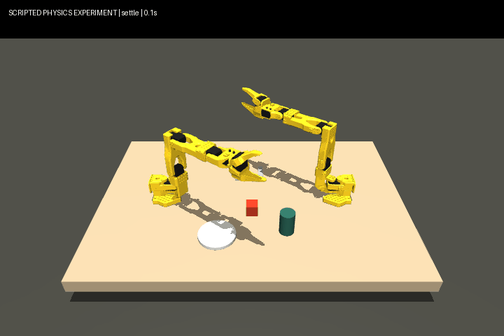

# Contact experiment — 16 September 2026

Two SO-101 arms are present. Only the left arm performs this scripted cube task;
the right arm stays parked. This is a ground-truth IK teacher experiment, not a
learned policy, visual reasoning, bimanual cooperation or dinner-table completion.



## Executed result

At 15:35 PKT / 10:35 UTC on the Intel i5-1245U Windows laptop, the nominal run
lifted the cube at least **79.54 mm** throughout its one-second hold, carried it,
lowered it onto the table and released it. Final XY error was **9.14 mm**.
Nineteen simulated seconds were recorded. The GIF plays simulation time, not wall time.

The fixed and moving fingers both contact the cube in every sampled hold/carry
state. Samples are 50 ms apart; physics steps are 2 ms. Lowering must retain the
grasp or have table support. Final placement must be within 25 mm, released,
within 12 mm of initial resting height, and stable within 2 mm over the last second.

Ten additional seeds (0–9) change cube XY by up to 5 mm and yaw by up to 0.12 rad.
**Six passed and four failed.** The teacher reads true object state. This small,
scripted experiment is not evidence of visual generalization or the event's ten
full-task evaluations. [All seed results](evidence/contact-seeds.json).

## What changed and what failed

The upstream end-effector site is near a finger surface. A grasp offset and shallower
approach allow the cube to enter the jaws. The default collision mode preserves
upstream geometry; optional decomposition replaces two jaw collision meshes with
12 convex pieces each, generated from the original STLs. Inertia, joint limits,
actuator gains, force limits and visible geometry remain unchanged. No grasp weld,
disabled object collision or object teleport is used. IK only edits scratch data.

CoACD's 12-piece cap exceeded its requested concavity threshold on both meshes;
the result is an approximation, not a guaranteed 4 mm tolerance. A finer first
decomposition attempt was stopped after approximately four minutes without output.

Thirty-six tuning configurations were tried, with both successes and failures
retained in the [rescored tuning audit](evidence/contact-tuning-audit.json).
An early scorer accepted a cube that slipped during transfer but landed near its
target. That was a false positive. **Scorer v3 rejects it**, and a regression test
replays that exact trace. The corrected nominal trial uses a deeper jaw position.

## Reproduce

First follow [simulator setup](LOCAL_FEASIBILITY.md), then:

```powershell
.venv/Scripts/python.exe tools/contact_probe.py --render --height .045 --roll 1.57 --grasp-offset -.035 0 .023 --collision-mode decomposed --tilt .2 --destination .025 -.14 --output artifacts/contact-new
```

Add `--seed 0` through `--seed 9` for the ten perturbations. Use distinct output
folders. Reports retain failures rather than selecting successful videos only.
Committed convex parts are hash-checked at model load. Regeneration is optional:
install `requirements-geometry.txt` and run `tools/decompose_gripper.py`.

Evidence: [nominal report](evidence/contact-report.json),
[nominal state/action trace](evidence/contact-trajectory.json),
[false-positive counterexample](evidence/contact-slip-trajectory.json).
The next substantive step remains successful demonstration collection and a
bounded learned-policy experiment. No task-trained checkpoint exists.
