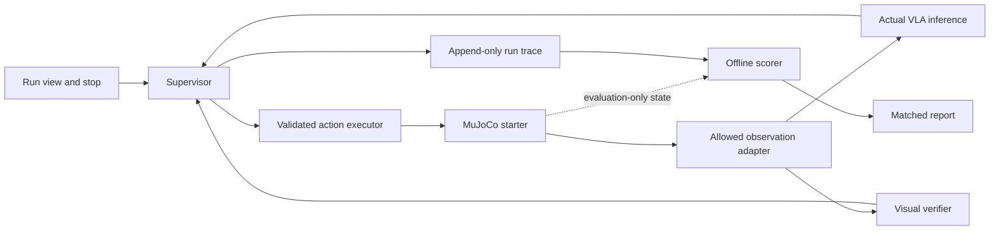

# LineProof — provisional product requirements

Version 0.1 · 11 September 2026 (PKT) · Documentation phase

**Status: proposed design, not a built or validated product.** LineProof is a working name. The repository currently contains a general tool runtime, evaluation helper, tests and design tokens. It has no robot adapter, VLA integration, product interface or product measurements. Every numerical performance threshold below is a **proposed target**, never a result.

## 1. Product decision and problem

LineProof would let a robotics integration engineer run one simulated two-arm manipulation job, see whether each action used a sufficiently recent observation, and inspect evidence that the job actually finished. The immediate user is an engineer evaluating a pretrained policy before investing in a larger integration. A technical reviewer is the secondary user of its traces and comparisons.

The problem hypothesis is that an apparently plausible action can arrive after the scene has changed, and an issued command can be mistaken for a completed task. Debugging needs the camera evidence, inference timing, executed action and observed outcome on one timeline. We have not interviewed users or measured their debugging costs. Value will first mean a reviewer can locate a failed transition and understand the response; no time-saving, revenue or customer claims are justified yet.

The proposed contribution is an inspectable link between observation age, coordinated action validity and post-action verification. Generic robot failure explanation and correction already appear in [REFLECT](https://arxiv.org/abs/2306.15724); visual feedback and replanning appear in [RePLan](https://arxiv.org/abs/2401.04157). These establish research overlap, not a performance comparison with LineProof. We claim neither research novelty nor superiority to those systems. The engineering hypothesis must earn support through matched experiments.

## 2. Event fit and constraints

The organizer lists an Intel bimanual VLA track and describes an online dual SO-101 simulation in MuJoCo using VLA and multimodal reasoning. This is an announcement, not a complete implementation specification. [Track dashboard](https://lablab.ai/ai-hackathons/ai-infra-summit-hackathon/live), [organizer announcement](https://www.linkedin.com/company/lablab-ai).

Intel confirms a virtual challenge on 10–16 September. [Intel announcement](https://www.intel.com/content/www/us/en/newsroom/news/artificial-intelligence/intel-at-ai-infra-summit-2026.html). The full online brief, starter, accepted models, mandatory processor/runtime, remote allocation and live judging rules remain unconfirmed. The public track page did not expose those details during this review. Enrollment and team eligibility also need confirmation.

| Milestone | Date and time |
|---|---|
| First complete slice, conditional on feasibility gates | 12 September 2026 (PKT) |
| Feature freeze | 15 September 2026, 14:00 PKT (09:00 UTC) |
| Internal submission target | 16 September 2026, 18:30 PKT (13:30 UTC) |
| Official submission deadline | 16 September 2026, 23:30 PKT (18:30 UTC) |

The official deadline is stated in the organizer's [indexed live dashboard](https://lablab.ai/ai-hackathons/ai-infra-summit-hackathon/live); recheck the enrolled submission form before release. Other milestones are project targets.

Development constraints: zero spend; Windows 11 laptop with i5-1245U, 32 GB RAM and Iris Xe; no verified NVIDIA device or WSL installation. Do not assume this machine can run the required policy. Free remote inference is acceptable only if the rules permit it and actual access, quotas and session duration cover the work. No physical robot purchase, heavy training or dependency on an unverified second machine.

Intel/OpenVINO integration is conditional on the actual online rules and compatible model/runtime. If adopted, the required inference must execute in the manipulation or verification loop with recorded provenance. An unrelated inference badge is insufficient. A measurement on this laptop is local evidence only; it cannot satisfy a mandated sponsor-device benchmark without that device and an executed benchmark. Qualcomm and SiMa integrations are deferred. Multiple-track or all-three prize eligibility is not assumed.

## 3. One job, selected conditionally

**Proposed job J1: handoff-and-place.** The left arm lifts one object from a source region and presents it; the right arm receives it and places it in a marked destination tray. Both arms must contribute to the transfer. A run in which one arm does everything while the other merely moves does not meet J1.

J1 is selected only if the official starter includes this job, or explicitly permits it with a compatible pretrained policy. No starter task ID or policy has been verified. Gate G1 must bind J1 to an exact starter revision, task ID, instruction, object, camera views, action schema and policy checkpoint. If J1 is unsupported, stop and revise this document around exactly one supported observable bimanual job before implementation; do not build a custom scene to preserve this story.

Proposed visible stages: `source grasp → presented → receiver grasp → released by giver → placed → verified`. The exact phase predicates must match the starter and permitted observations. The task requires views that distinguish a transfer from an object dropped behind a gripper. If available views cannot establish a phase, the verifier returns `unknown`.

At G1, define the simulator scoring predicate independently: transfer participation by both arms, object fully within the destination tolerance, released by the arms, stable for a declared dwell interval and no disqualifying task violation. Proposed dwell is 0.5 seconds of simulation time. Position, velocity and task-violation tolerances remain unset until the official task supplies its geometry and scoring rules; lock them before held-out evaluation. Use the official scoring rule where mandated and report any stricter diagnostic separately.

## 4. Goals and scope

P0 goals are to execute J1 with an actual accepted VLA, reject invalid or stale actions, verify outcomes from new observations, recover once when permitted or stop, and produce a reproducible comparison against the same policy without the added supervisor. A reviewer should be able to identify the observation behind an action and the evidence behind a completion claim.

| P0 | Deferred / non-goal |
|---|---|
| One scene, job, checkpoint and permitted inference path | Multiple tasks, model search, cross-device optimization |
| Timestamped frames and coordinated two-arm action chunks | Physical deployment or certified safety |
| One bounded reacquire-and-replan recovery path | Open-ended recovery planning, repeated blind retries |
| Camera-based phase/outcome verification and separate scoring | Ground-truth-assisted grasping or hidden oracle control |
| One run view, stop control, trace export, matched evaluation | Accounts, collaboration service, fleet dashboard, billing |
| Clearly separated live simulation, recorded replay and smoke test | Passing scripted motion or replay off as VLA execution |
| Rules-compatible use of existing pretrained weights | Heavy training, custom dataset collection to rescue incompatibility |

## 5. Main flow and failure behavior

1. The engineer opens a run view, sees `LIVE SIMULATION`, the selected task, policy, execution device and readiness checks. They select a published scenario/seed and start a fresh episode. Missing mandatory resources prevent start.
2. The simulator emits camera frames and permitted robot telemetry. The system timestamps them, checks cross-camera alignment, and sends the instruction plus allowed observations to the real VLA.
3. The supervisor validates the returned action against its observation, episode, age budget, shape, bounds and coordinated arm state. It either authorizes a short chunk or discards it and acquires a new observation.
4. The executor applies each authorized chunk once. New post-action camera evidence drives phase verification. Finishing a command or exhausting a plan does not establish completion.
5. On an observable recoverable failure, the supervisor invalidates pending actions and requests one new plan from fresh observations. The system records the reason and the new inference. If evidence is inadequate or the recovery budget is exhausted, it stops.
6. The run ends as `verified complete`, `stopped`, `failed` or `error`. A separate evaluation panel later shows oracle success/failure and disagreements. The engineer can export the trace and inspect the matched baseline report.

| Trigger | Required behavior |
|---|---|
| Stale, duplicate, out-of-order or mixed-episode frame | Reject affected bundle; hold according to the starter's allowed control mode; reacquire within the budget |
| Inference arrives late, after stop, reset or a newer plan | Discard the response; never revive its actions |
| Occluded transfer, ambiguous placement or verifier disagreement | Show `unknown`; acquire fresh evidence; never promote to success |
| Missed handoff or dropped object | Request one recovery only if the state is observable and the starter supports it; otherwise stop |
| Invalid values, wrong action dimension, out-of-bounds motion | Reject before execution and stop with a specific reason |
| Partial/uncertain command acknowledgement | Query permitted execution status; do not resend motion; stop if execution cannot be resolved |
| Policy/runtime/network failure or free quota exhaustion | End the live attempt visibly; offer a separately selected recorded replay |
| Operator stop or control/episode timeout | Invalidate both arms' pending actions and enter the tested simulator stop state |
| Reset requested | End the old episode and clear queues; reset creates a new run, never a successful recovery |

A simulated stop is not a real robot emergency-stop guarantee. Stopping must use a starter-supported hold/pause/termination behavior verified in G3; sending an arbitrary zero command is not assumed safe or meaningful.

## 6. Requirements and acceptance criteria

All requirements below are proposed and unverified. G1–G3 feasibility evidence precedes product acceptance. The IDs are stable references for later implementation and release checks.

| ID | Priority | Requirement and acceptance evidence |
|---|---|---|
| LP-01 | P0 | **Track readiness:** before build commitment, record official task/rules links, eligibility, licenses, free access, runtime/device requirements and judging route. G1 passes only with resolved mandatory items. |
| LP-02 | P0 | **Real bimanual VLA and multimodal reasoning:** execute J1 using an accepted pretrained checkpoint consuming images and language and producing the arm actions through a disclosed decoder/controller. Capture input references, checkpoint hash and output/action trace. Bind the event's separate reasoning requirement to an executed component and observable decision evidence (§8). Three fresh baseline attempts must run, with at least one oracle-scored J1 success for G2. |
| LP-03 | P0 | **Observation validity:** every authorized action references a unique episode and frame bundle with capture times. Fault checks for old, reordered, skewed, missing and cross-episode frames authorize zero invalid actions. |
| LP-04 | P0 | **Action validity:** validate age and execution epoch at dispatch and each interruptible chunk boundary; reject nonfinite values, invalid shape and limits. Stop/reset invalidates both arms and all late responses. Tests include expiration during inference and during a queued chunk. |
| LP-05 | P0 | **Post-action evidence:** no phase advances or completion occurs without fresh camera evidence after the corresponding action-completion acknowledgement, not merely dispatch acknowledgement. Occlusion, failed transfer and pre-action-frame substitution must yield failure/unknown rather than a completion claim. |
| LP-06 | P0 | **Bounded response:** at most one recovery replan per episode and two consecutive fresh-observation attempts at a blocked transition; otherwise stop. Exercise recovery, exhausted budget, operator stop and unresolved action acknowledgement. No motion tool is automatically retried. |
| LP-07 | P0 | **Information boundary:** policy, supervisor and visual verifier receive only allowlisted observations. Hidden poses, contacts, rewards, success flags and perturbation schedules are available only to the evaluation/scene harness. Review interfaces and record their exposed fields; demonstrate scoring can be disabled without changing control decisions. |
| LP-08 | P0 | **Reproducible comparison:** publish a pinned baseline and supervisor configuration, frozen development/held-out split, matched seed schedule, raw outcomes and aggregate metrics as specified in §9. Include failures and missing pairs. |
| LP-09 | P0 | **Honest modes:** persistent mode labels on screen and in exports; replay cannot call live inference or actuators; a missing recording fails visibly. Scripted smoke runs are excluded from VLA and product metrics. |
| LP-10 | P0 | **Sponsor execution:** demonstrate actual rule-required inference, including model/runtime/device provenance and cold/warm timing. Record separately any required sponsor-device result. If mandatory hardware is inaccessible, eligibility remains blocked. |
| LP-11 | P0 | **Inspectable run:** one screen exposes episode, phase, frame age, validity decision, executed chunk, verification evidence, recovery/stop reason and mode. A reviewer can trace an action to its frame and outcome without accessing hidden scoring data. |
| LP-12 | P0 | **Repeatable release:** a fresh supported environment follows pinned setup instructions, runs the selected live task and one failure scenario, and reproduces trace/report generation. Verify release links, artifact licenses, sanitized exports and final form requirements. |
| LP-13 | Deferred | Additional tasks, hardware adapters, extensive ablations and persistent multi-user storage require a separate scope decision after P0. |

## 7. Time, action and verification contract

An observation envelope contains `episode_id`, `observation_id`, per-camera frame IDs/hashes, simulation capture time, host monotonic capture/receipt times, synchronization uncertainty and allowed robot telemetry. An action envelope adds `action_id`, source observation ID, policy/checkpoint/runtime versions, inference start/end, execution epoch, joint schema/units, chunk horizon and expiry. The trace records dispatch, acknowledgement, completion/abort and verification timestamps separately.

Use one host monotonic clock for elapsed budgets. Wall-clock UTC with a PKT display is for human provenance, not expiry arithmetic. Simulation time is a separate clock. Pausing the simulator does not stop wall-time aging. For a remote camera/inference source, use a documented clock mapping with uncertainty or a conservative age bound including transport; never subtract unsynchronized clocks. Unknown age fails closed.

At execution, require all of the following:

- Same active episode and execution epoch; the observation and action have not been superseded or consumed.
- Wall age plus clock uncertainty is within `max_wall_age`; simulated scene age is within `max_sim_age`; per-camera skew is within `max_camera_skew`.
- The chunk can finish within the applicable expiry and declared maximum horizon. Recheck remaining validity at each interruptible boundary.
- Both arms' coordinated action is valid. Do not execute one half of a rejected pair. Where the API dispatches arms separately, a tested barrier and acknowledgement contract are required; unresolved partial dispatch stops the episode.

Initial proposed tuning ceilings: wall age 5,000 ms, scene age 250 ms, camera skew 50 ms, interruptible chunk horizon 100 ms of simulation time. These are starting assumptions, not a hardware claim or universal robotics recommendation. G2 must replace or confirm them from the starter's cadence, supported chunking and development-only observations. Lock the resulting numeric values before held-out runs. If required inference routinely exceeds useful scene validity, stop or use an explicitly permitted execution mode; do not enlarge budgets until the test passes.

Show simulator pacing explicitly: real-time attempt, slowed simulation or stepped/paused execution. Report simulated-time/wall-time ratio. A pause during every inference may support a permitted demo but cannot demonstrate handling a changing scene during inference. Timing experiments must advance the scene or apply the scheduled scene change while inference is pending, under the same pacing for both arms of the comparison.

The verifier is a separate decision stage using post-action images and task predicates, not the policy's text claim, plan status or simulator reward. A small deterministic image verifier is preferred if the starter scene permits reliable observability; otherwise a compatible multimodal verifier must pass G3 within budget. Its implementation, thresholds and shared model dependencies must be disclosed. Separate logic does not imply statistically independent model errors.

For proposed completion, require the final predicate across at least two distinct fresh frames spanning the declared dwell interval, with no contradictory sampled evidence between them. Lock a maximum verification frame gap in G2; missing coverage produces `unknown`. Frames must follow the relevant action completion and show the final state. Sampled visual stability is evidence, not proof of continuous physical stability. The policy can request a check but cannot set `verified complete`. A visual false positive remains a product error even if a narrative explanation sounds plausible.

## 8. Minimal architecture and existing scaffold

Prefer a single local Python process and a minimal run viewer, with one adapter boundary for allowed remote inference. Use the starter's supported Python/environment version; the existing laptop Python version does not prove package compatibility. Pin the actual compatible environment after G1. No database, distributed queue or extra agent framework is required for P0.

The observation adapter is an allowlist, not a pass-through of simulator state. Rendered RGB and official robot proprioception are permitted only as specified by the starter. Exact object poses, hidden contacts, reward/success flags and failure injection labels must never feed the policy, verifier, recovery selection or completion decision. The harness may use hidden state for reproducible initialization, perturbation injection and scoring; the controller cannot read that channel. If an official baseline uses privileged state, disclose it and obtain/construct a compliant baseline before claiming a vision-driven comparison.

The VLA must be an actual vision-language-action policy accepted for the task. A VLM choosing among handcrafted trajectories does not satisfy this requirement unless the official definition explicitly accepts that architecture. A scripted smoke test may validate rendering, joint ordering and stop behavior; label it `SCRIPTED SMOKE TEST — NO VLA` and never count it as G2/G3 completion. No model is selected merely because it is small or popular.

G1 must resolve what the track means by multimodal reasoning in addition to VLA control: accepted component, inputs and required outputs. Prefer the accepted policy's own supported task/phase decisions if sufficient under the rules. If a separate reasoning component is mandated, verify its free inference feasibility too. Evidence must link an actual image-and-instruction input to an executed decision such as continue, reacquire or stop; use concise structured outputs and frame references. A retrospective caption or deterministic image verifier alone cannot stand in for mandated model reasoning. G3 must demonstrate the accepted reasoning path, with its latency and resource use included in evaluation.

The existing runtime offers tool validation, timeouts and record/replay. It does not provide robotics timestamps, execution acknowledgements, stop semantics or safe motion cancellation. Add those contracts only in the later implementation phase. A timed-out inference can return remotely after local cancellation; the executor must reject its invalidated epoch. Motion submission remains non-retryable even when generic read/inference retries are enabled. Replay artifacts preserve source versions and capture mode, and must not enter a live motion queue.

## 9. Evaluation and proposed targets

Freeze the checkpoint, camera setup, task definition, decoding settings, precision, control cadence, simulator version, stop limits and all thresholds after development. Preserve the official baseline behavior; the comparison baseline has the same policy, device, action adapter, essential validity/stop limits and time budget, but no added freshness supervisor, post-action verification or recovery. If the official baseline already has these features, document the overlap and define precisely what is added; never weaken it to manufacture an improvement. An evaluation-only observer may score both runs without controlling either.

Proposed minimum: 10 development episodes for calibration, followed by 30 held-out matched pairs (60 actual inference episodes): 10 nominal, 10 timing-perturbed and 10 manipulation/visibility-perturbed. Use unseen seeds and unseen perturbation combinations or magnitudes within declared supported ranges. Split manipulation cases into five potentially recoverable handoff failures and five unrecoverable/ambiguous cases. Register those categories from the scenario definition before observing method outcomes.

Timing cases include delayed observations or inference while the scene changes; manipulation cases include supported object displacement, missed grasp or temporary occlusion. Final perturbations must respect track permissions and be physically meaningful in the starter. Publish exact distributions, magnitudes, injection times and seeds for reproduction after evaluation. Keep their schedule hidden from controller inputs. Match initial states, exogenous perturbation schedule, policy RNG seed, pacing and resource limits; alternate baseline/supervisor execution order. Closed-loop trajectories may diverge after intervention—that is an outcome, not a matching defect.

No tuning on held-out cases. A subsequent fix requires a new version and fresh holdout, with prior results retained. Report all launched attempts, timeouts and crashes. Infrastructure exclusions require a declared reason; report both intended and completed pair counts. A run with zero completion claims has undefined false-success-among-claims, not a perfect score. Baseline terminal claims must retain their native meaning; if absent, report that claim metric as unavailable, never infer success from plan exhaustion.

| Measure | Definition | Proposed target / reporting rule |
|---|---|---|
| Task success | Oracle-scored successful episodes / all launched episodes; report nominal and each perturbation group | Supervisor nominal at least 8/10; at least 20/25 in the predeclared completion-eligible scenarios. Also report the all-30 rate including the five expected-stop cases, which are never counted as task successes merely for stopping. These are small-sample targets, not robustness evidence. |
| Comparative benefit | Paired success difference and paired false-success difference; list discordant pairs | Perturbed success at least 2/20 episodes higher than baseline, nominal loss at most 1/10. If missed, report no demonstrated benefit. |
| False success | Claimed complete while oracle predicate is false at claim time; report per episode and per completion claim | Zero observed false-success claims in held-out supervisor runs; show denominators and uncertainty, never claim zero underlying risk. |
| Missed success | Oracle success achieved but no valid completion claim before timeout | Report count/rate; prevents a system that always stops from looking effective. |
| Recovery | Successful completion after one recovery / all predeclared recoverable cases; also report / actual recovery attempts | At least 3/5 recoverable cases completed, at most one recovery per episode. Reset/restart is not recovery. |
| Stop behavior | Required stops honored, unnecessary stops, stop-command-to-no-further-action delay, post-stop commands | All predeclared required stops honored; zero later motion authorization; stop accepted by next supported control boundary. Initial wall target 250 ms on a responsive local executor, plus measured simulation delay. |
| Validity | Stale/invalid actions executed or authorized; report counts and rejected-action age distribution | Zero invalid authorizations/executions in dedicated fault checks and held-out supervisor runs. |
| Latency | Capture-to-dispatch, model inference, queue/transport, execution, verification and full episode wall duration | p50/p95, sample count, units, cold/warm split and per-run maxima. Timing must fit locked G2 budgets; no assumed FPS claim. |
| Overhead | Supervisor decision time and verification time; paired episode wall-time difference including extra inference/holds | Proposed supervisor bookkeeping p95 at most 50 ms; nominal paired median episode overhead at most 25%. Report absolute ms too. |
| Resources | Peak process memory, model load time, runtime/device/precision, remote queue/quota failures, simulation pacing | Fit available memory without out-of-memory failures or paid access. Report observed usage, not hardware specifications as results. |

For overhead percentages use `(supervised − baseline) / baseline` only where both nominal episodes complete; show the subset count and separately report all-episode time-to-terminal and timeout counts so failures cannot disappear. Small denominators limit inference: include binomial intervals for rates and paired counts/intervals for differences where feasible. Do not describe the experiment as statistically conclusive or a comparison against published research benchmarks.

Each evidence bundle must include command, commit, timestamp in PKT/UTC, actual OS/device, dependency lock, model/checkpoint hash and license, runtime/precision, simulator/starter revision, scenario manifest, seeds, warmup, budgets, raw trace hashes and scoring implementation/version. Store failed runs as well as successes. Record exact sponsor execution/job provenance where required. Later results belong in the repository benchmark record; this PRD remains a statement of targets.

## 10. Interface and truthful demonstration

Use one restrained instrument view: simulator camera evidence beside the current phase, a compact timing strip, and a chronological trace. Show age versus budget, action accepted/rejected, and verifier verdict with frame links. Use readable text, units, tabular numerals and labeled statuses; color alone must not convey validity. Keep the stop control visible. No fabricated telemetry, generated robotics footage or claimed user numbers.

Persistent modes:

- `LIVE SIMULATION`: new inference and simulator execution now; show actual local/remote device and pacing.
- `RECORDED REPLAY`: playback of a named prior run; show its date, commit, device and original result. Scrubbing does not execute inference. A live failure stays in the record when switching modes.
- `SCRIPTED SMOKE TEST — NO VLA`: developer-only motion/adapter check, outside product evaluation.

Proposed demo length is 3:30, subject to the final form limit: explain the failure in the first 20 seconds; show one nominal live run, a matched timing failure and supervised response; show one honest stop; finish with measured comparison, architecture and limitations. Keep a recorded run available as a disclosed fallback. Recording alone is not assumed sufficient for judging. Any edited, sped-up or replayed segment must retain its label and original elapsed duration.

## 11. Feasibility gates and dependencies

These are the next phase's three active-work blocks, **at most 45 minutes each**, not work completed by this document. Calendar waiting or missing credentials is not a pass. Stop expanding the design at the first unmet essential gate; do not spend additional blocks training or porting an incompatible model.

| Gate | Work and dependencies | Evidence needed to proceed | No-go / blocked condition |
|---|---|---|---|
| G1 — requirements and access | Obtain official online brief/starter; confirm enrollment, permitted J1, pretrained checkpoint, model/data licenses, hardware/runtime, free resources and live judging requirements | Exact links/revisions; task/action/camera compatibility matrix; working access to all mandatory free resources; viable local or permitted remote execution route | Missing mandatory rules/access, unsupported J1/policy, required purchase, inaccessible sponsor device, or required new training |
| G2 — actual baseline | Run official simulation and accepted VLA on available compute; inspect memory, inference time, action schema and simulator cadence | Three fresh baseline attempts and at least one scored bimanual success; saved traces; numeric timing/episode budgets locked using development evidence | Smoke test only, no successful actual baseline, infeasible runtime/memory, expired free sessions or incompatible model actions |
| G3 — observe/act/verify | Complete real observation → required inference → executed action → changed simulation → fresh visual verification; exercise one fault and stop | One successful full trace, one rejected stale action or bounded failure trace, tested two-arm stop, actual mandated sponsor inference/device evidence | Hidden oracle control, missing verifier observability, stale actions still executable, only replay, or mandatory inference absent |

Proposed initial episode timeout is 120 seconds wall time; G2 must confirm or replace it to match rules and demonstrated cadence before evaluation. Each gate ends with a pass/fail/blocked note and artifact references. None is passed today.

After G3, build only P0, target the first E2E by 12 September (PKT), harden and measure on 13–14 September, and freeze at 15 September 14:00 PKT (09:00 UTC). This sequence is conditional on gate timing. If a required gate remains blocked, reassess scope immediately rather than consuming the remaining deadline window on speculative integration.

Loadout is a possible alternative only after its own track eligibility, mandated hardware and free-access checks. It is not an automatically eligible fallback. Adding Qualcomm or SiMa cannot resolve a failed Intel gate by itself.

## 12. Demo and release checklist

Documentation phase may finish while implementation gates remain blocked. A submission-ready prototype requires all applicable checks below; a missed outcome target must remain visible and requires narrowing the claim rather than relabeling the result.

- [ ] G1–G3 evidence reviewed; exact online requirements and accepted execution route recorded (LP-01/02/10).
- [ ] One actual J1 live run, recovery/failure case and stop reproduced; no smoke/replay substitution (LP-02/06/09).
- [ ] Timing, late response, reset, partial acknowledgement and post-action verification fault checks pass (LP-03/04/05/06).
- [ ] Controller/visual-verifier inputs audited; oracle channel only scores or initializes/injects scenarios (LP-07).
- [ ] Held-out matched runs and raw traces published with denominators, unsuccessful attempts, pacing and measured overhead; targets clearly separated from results (LP-08).
- [ ] Sponsor inference provenance and any mandated device benchmark verified independently (LP-10).
- [ ] Fresh setup succeeds; README updated from scaffold direction with actual prerequisites, run instructions and limitations (LP-12).
- [ ] Live and replay modes verified separately; online/demo URL accessible to reviewers under the event's permitted access model; free availability covers judging (LP-09/12).
- [ ] Trace exports, screenshots and public files contain no credentials, private paths or unrelated information; model/data/asset licenses and attribution checked (LP-12).
- [ ] Final event form checked for descriptions, tags, cover, video duration/format, slides, repository, application URL and any extra report. The [general submission guide](https://lablab.ai/delivering-your-hackathon-solution) is a checklist starting point, not confirmation of this event's fields.
- [ ] Watch the final video and open every release link without the author's session; confirm simulation/replay labels, measured values and limits remain readable.
- [ ] Feature freeze and submission targets honored; final submission receipt retained.

Open blockers are the official brief/starter, compatible pretrained policy, free runtime/device access, supported observation and action contracts, enrollment, live judging requirements and final form. Passing documentation review resolves none of these. The next decision is whether the three bounded feasibility blocks establish an eligible, observable and executable product.
