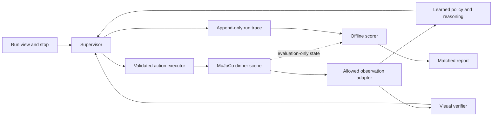

# LineProof — provisional product requirements

Version 0.2 · 12 September 2026 (PKT) · Official-brief reconciliation

**Status: proposed product design, not a validated product.** As of 16 September, a local dual-SO101 physics smoke test and random-weight ACT/OpenVINO CPU preflight have executed; see [measured evidence](LOCAL_FEASIBILITY.md). There is still no learned task policy, full-task completion or product interface. Every numerical performance threshold below remains a **proposed target**, never a result.

## 1. Product decision and problem

LineProof would let a robotics integration engineer run one simulated multi-step dinner-table job, see whether each action used a sufficiently recent observation, and inspect evidence that the job actually finished. The immediate user is an engineer evaluating a learned policy before investing in a larger integration. A technical reviewer is the secondary user of its traces and comparisons.

The problem hypothesis is that an apparently plausible action can arrive after the scene has changed, and an issued command can be mistaken for a completed task. Debugging needs the camera evidence, inference timing, executed action and observed outcome on one timeline. We have not interviewed users or measured their debugging costs. Value will first mean a reviewer can locate a failed transition and understand the response; no time-saving, revenue or customer claims are justified yet.

The proposed contribution is an inspectable link between observation age, coordinated action validity and post-action verification. Generic robot failure explanation and correction already appear in [REFLECT](https://arxiv.org/abs/2306.15724); visual feedback and replanning appear in [RePLan](https://arxiv.org/abs/2401.04157). These establish research overlap, not a performance comparison with LineProof. We claim neither research novelty nor superiority to those systems. The engineering hypothesis must earn support through matched experiments.

## 2. Event fit and constraints

The five-page [official Intel online brief](https://drive.google.com/file/d/1xSisqTQUAFQiLOpjLZrCVTCsQi4bMCpO/view) supersedes version 0.1's provisional rules. The following are organizer requirements, distinct from our implementation choices:

| Brief pages | Requirement |
|---|---|
| 1–2 | Multi-step dinner-table manipulation in MuJoCo with two SO-101 arms, camera/instruction reasoning, and a VLA or related imitation policy; ACT, SmolVLA and Pi0.5 are named options. |
| 3–4 | Final MuJoCo simulation and AI/VLA/VLM inference, plus benchmarks, run on Core Ultra Series 2/3. Physical arms are unnecessary. Intel does not supply training compute. |
| 2–5 | Randomize placement, physical and visual properties; evaluate over 10 randomized seeds. Use OpenVINO compilation/quantization where supported and preserve task/reasoning quality. Report latency, throughput, device and precision. |
| 4 | Deliver scene/assets/randomization, training or fine-tuning, evaluation and inference code, setup instructions, Intel benchmark script, architecture/README, and a video demonstrating successful execution across 10 randomized seeds. |

The brief supplies no numerical placement tolerances, success-rate threshold, latency target or mandatory quantization precision. It does not promise an organizer checkpoint or require an organizer-supplied starter. Its recommended demo sequence includes a handoff **or** complementary two-arm action. Page 5 weights completion/coordination 30%, reasoning 20%, robustness 15%, Intel optimization 20%, reproducibility 10% and innovation 5%.

The [event dashboard](https://lablab.ai/ai-hackathons/ai-infra-summit-hackathon/live) identifies Intel as online and Qualcomm/SiMa as onsite, with one track per project. Loadout/Qualcomm is not an eligible online fallback under that published route. Speechmatics is optional; it is outside P0. The brief confirms video delivery; final form fields and any live attendance arrangements still need checking.

| Milestone | Date and time |
|---|---|
| First complete slice | Conditional on G1–G3; not achieved |
| Feature freeze | 15 September 2026, 14:00 PKT (09:00 UTC) |
| Internal submission target | 16 September 2026, 18:30 PKT (13:30 UTC) |
| Official submission deadline | 16 September 2026, 23:30 PKT (18:30 UTC) |

The deadline comes from the event dashboard; other dates are internal targets. Recheck the submission form before release. Zero spend remains a project constraint. The available i5-1245U/32 GB/Iris Xe laptop is a development candidate, **not a compliant final target**. Free Core Ultra advertising is not an allocation. G1 needs a usable final machine and a separate explicit training resource plan; neither is established by documentation. No paid resource or large training project is authorized.

## 3. One full task and the developmental slice

**J1: set the dinner table.** Our proposed sequence is: open the drawer; retrieve and place a spoon and fork; place a plate; transfer a cup between arms and place it in its target region. Both arms must make useful contributions. This covers the stated drawer/cutlery/plate/cup scenario and chooses handoff as the coordination demonstration. The brief also gives mug-holding/pouring as an example; we do not claim to simulate liquids. These particular arm assignments and sequence are engineering choices, not a verbatim mandatory script.

The initial single-object handoff is only an adapter/training smoke slice. It cannot satisfy the full-task baseline gate or submission. Proposed six phase labels are `open_drawer`, `place_spoon`, `place_fork`, `place_plate`, `handoff_cup`, `place_cup`. A phase may contain several grasps and reaches. The model's phase decision must be grounded in the instruction and current images; the phase code is not an oracle success flag.

Build the scene from the upstream SO-101 MJCF resource identified in [FEASIBILITY.md](FEASIBILITY.md), with a second namespaced arm, a sliding drawer, simple cutlery/plate/cup assets, two fixed cameras and target regions. Joint order is six joints per arm; limits and radian units come from that pinned model. No existing complete scene or compatible learned task checkpoint has been verified. Scene composition, demonstration generation and task training are real remaining work.

Before held-out evaluation, freeze feasible geometry, grasp physics, drawer travel, placement/velocity tolerances, randomization ranges, camera coverage and a proposed 0.5-second final dwell. The scorer requires drawer interaction, retrieval and final placement of every item, useful participation by both arms, the cup transfer, release and stability. Missing any stage is partial completion. Report stage outcomes separately. Geometric thresholds are project choices because the brief does not give numerical tolerances. A view that cannot establish a predicate yields `unknown`.

## 4. Goals and scope

P0 goals are to execute J1 with an actual learned ACT or VLA policy plus multimodal reasoning, reject invalid or stale actions, verify outcomes from new observations, recover once when permitted or stop, and produce a reproducible comparison against the same policy without the added supervisor. A reviewer should be able to identify the observation behind an action and the evidence behind a completion claim.

| P0 | Deferred / non-goal |
|---|---|
| One full dinner task, learned policy and Core Ultra inference path | Additional tasks and broad model search |
| Timestamped frames and coordinated two-arm action chunks | Physical deployment or certified safety |
| One bounded reacquire-and-replan recovery path | Open-ended recovery planning, repeated blind retries |
| Camera-based phase/outcome verification and separate scoring | Ground-truth-assisted grasping or hidden oracle control |
| One run view, stop control, trace export, matched evaluation | Accounts, collaboration service, fleet dashboard, billing |
| Clearly separated live simulation, recorded replay and smoke test | Passing scripted motion or replay off as VLA execution |
| Existing weights where compatible; bounded task-training pilot evaluated separately | Heavy training or unbounded dataset collection |

## 5. Main flow and failure behavior

1. The engineer opens a run view, sees `LIVE SIMULATION`, the selected task, policy, execution device and readiness checks. They select a published scenario/seed and start a fresh episode. Missing mandatory resources prevent start.
2. The simulator emits camera frames and permitted robot telemetry. The system timestamps them, checks cross-camera alignment, and sends the instruction plus allowed observations to the learned policy and reasoning component.
3. The supervisor validates the returned action against its observation, episode, age budget, shape, bounds and coordinated arm state. It either authorizes a short chunk or discards it and acquires a new observation.
4. The executor applies each authorized chunk once. New post-action camera evidence drives phase verification. Finishing a command or exhausting a plan does not establish completion.
5. On an observable recoverable failure, the supervisor invalidates pending actions and requests one new plan from fresh observations. The system records the reason and the new inference. If evidence is inadequate or the recovery budget is exhausted, it stops.
6. The run ends as `verified complete`, `stopped`, `failed` or `error`. A separate evaluation panel later shows oracle success/failure and disagreements. The engineer can export the trace and inspect the matched baseline report.

| Trigger | Required behavior |
|---|---|
| Stale, duplicate, out-of-order or mixed-episode frame | Reject affected bundle; hold according to the scene's allowed control mode; reacquire within the budget |
| Inference arrives late, after stop, reset or a newer plan | Discard the response; never revive its actions |
| Occluded transfer, ambiguous placement or verifier disagreement | Show `unknown`; acquire fresh evidence; never promote to success |
| Missed handoff or dropped object | Request one recovery only if the state is observable and the scene supports it; otherwise stop |
| Invalid values, wrong action dimension, out-of-bounds motion | Reject before execution and stop with a specific reason |
| Partial/uncertain command acknowledgement | Query permitted execution status; do not resend motion; stop if execution cannot be resolved |
| Policy/runtime/network failure or free quota exhaustion | End the live attempt visibly; offer a separately selected recorded replay |
| Operator stop or control/episode timeout | Invalidate both arms' pending actions and enter the tested simulator stop state |
| Reset requested | End the old episode and clear queues; reset creates a new run, never a successful recovery |

A simulated stop is not a real robot emergency-stop guarantee. Stopping must use a scene-supported hold/pause/termination behavior verified in G3; sending an arbitrary zero command is not assumed safe or meaningful.

## 6. Requirements and acceptance criteria

All requirements below are proposed and unverified. G1–G3 feasibility evidence precedes product acceptance. The IDs are stable references for later implementation and release checks.

| ID | Priority | Requirement and acceptance evidence |
|---|---|---|
| LP-01 | P0 | **Track readiness:** before build commitment, record official task/rules links, eligibility, licenses, free access, runtime/device requirements and judging route. G1 passes only with resolved mandatory items. |
| LP-02 | P0 | **Learned control and multimodal reasoning:** execute full J1 using an ACT or VLA policy; record camera/state inputs, task/phase conditioning, learned checkpoint hash and resulting 12-joint actions. ACT alone is not language reasoning: the separate image-and-instruction component must affect executed decisions (§8). G2 requires three fresh full-task baseline attempts with at least one oracle-scored complete success. Random weights, scripted control and a successful handoff alone cannot pass. |
| LP-03 | P0 | **Observation validity:** every authorized action references a unique episode and frame bundle with capture times. Fault checks for old, reordered, skewed, missing and cross-episode frames authorize zero invalid actions. |
| LP-04 | P0 | **Action validity:** validate age and execution epoch at dispatch and each interruptible chunk boundary; reject nonfinite values, invalid shape and limits. Stop/reset invalidates both arms and all late responses. Tests include expiration during inference and during a queued chunk. |
| LP-05 | P0 | **Post-action evidence:** no phase advances or completion occurs without fresh camera evidence after the corresponding action-completion acknowledgement, not merely dispatch acknowledgement. Occlusion, failed transfer and pre-action-frame substitution must yield failure/unknown rather than a completion claim. |
| LP-06 | P0 | **Bounded response:** at most one recovery replan per episode and two consecutive fresh-observation attempts at a blocked transition; otherwise stop. Exercise recovery, exhausted budget, operator stop and unresolved action acknowledgement. No motion tool is automatically retried. |
| LP-07 | P0 | **Information boundary:** policy, supervisor and visual verifier receive only our explicitly allowlisted observations. This is a project integrity requirement, not a ban stated by the organizer. Hidden poses, contacts, rewards, success flags and perturbation schedules are available only to the evaluation/scene harness. Review interfaces and record their exposed fields; demonstrate scoring can be disabled without changing control decisions. |
| LP-08 | P0 | **Reproducible comparison:** publish a pinned baseline and supervisor configuration, frozen development/held-out split, matched seed schedule, raw outcomes and aggregate metrics as specified in §9. Include failures and missing pairs. |
| LP-09 | P0 | **Honest modes:** persistent mode labels on screen and in exports; replay cannot call live inference or actuators; a missing recording fails visibly. Scripted smoke runs are excluded from VLA and product metrics. |
| LP-10 | P0 | **Intel execution:** run final MuJoCo and all required AI inference on Core Ultra Series 2/3; benchmark actual device, runtime, precision, cold/warm latency and throughput. Compare applicable OpenVINO optimization with the reference while checking quality. If mandatory hardware is inaccessible, eligibility remains blocked. |
| LP-11 | P0 | **Inspectable run:** one screen exposes episode, phase, frame age, validity decision, executed chunk, verification evidence, recovery/stop reason and mode. A reviewer can trace an action to its frame and outcome without accessing hidden scoring data. |
| LP-12 | P0 | **Repeatable release:** a fresh supported environment follows pinned setup instructions, runs the selected live task and one failure scenario, and reproduces trace/report generation. Include scene/randomization and training/fine-tuning/evaluation/inference code, the Intel benchmark script and required 10-seed video evidence. Verify release links, licenses, sanitized exports and final form requirements. |
| LP-13 | Deferred | Additional tasks, hardware adapters, extensive ablations and persistent multi-user storage require a separate scope decision after P0. |

## 7. Time, action and verification contract

An observation envelope contains `episode_id`, `observation_id`, per-camera frame IDs/hashes, simulation capture time, host monotonic capture/receipt times, synchronization uncertainty and allowed robot telemetry. An action envelope adds `action_id`, source observation ID, policy/checkpoint/runtime versions, inference start/end, execution epoch, joint schema/units, chunk horizon and expiry. The trace records dispatch, acknowledgement, completion/abort and verification timestamps separately.

Use one host monotonic clock for elapsed budgets. Wall-clock UTC with a PKT display is for human provenance, not expiry arithmetic. Simulation time is a separate clock. Pausing the simulator does not stop wall-time aging. For a remote camera/inference source, use a documented clock mapping with uncertainty or a conservative age bound including transport; never subtract unsynchronized clocks. Unknown age fails closed.

At execution, require all of the following:

- Same active episode and execution epoch; the observation and action have not been superseded or consumed.
- Wall age plus clock uncertainty is within `max_wall_age`; simulated scene age is within `max_sim_age`; per-camera skew is within `max_camera_skew`.
- The chunk can finish within the applicable expiry and declared maximum horizon. Recheck remaining validity at each interruptible boundary.
- Both arms' coordinated action is valid. Do not execute one half of a rejected pair. Where the API dispatches arms separately, a tested barrier and acknowledgement contract are required; unresolved partial dispatch stops the episode.

Initial proposed tuning ceilings: wall age 5,000 ms, scene age 250 ms, camera skew 50 ms, interruptible chunk horizon 100 ms of simulation time. These are starting assumptions, not a hardware claim or universal robotics recommendation. G2 must replace or confirm them from the scene's cadence, supported chunking and development-only observations. Lock the resulting numeric values before held-out runs. If required inference routinely exceeds useful scene validity, stop or use an explicitly permitted execution mode; do not enlarge budgets until the test passes.

Show simulator pacing explicitly: real-time attempt, slowed simulation or stepped/paused execution. Report simulated-time/wall-time ratio. A pause during every inference may support a permitted demo but cannot demonstrate handling a changing scene during inference. Timing experiments must advance the scene or apply the scheduled scene change while inference is pending, under the same pacing for both arms of the comparison.

The verifier is a separate decision stage using post-action images and task predicates, not the policy's text claim, plan status or simulator reward. A small deterministic image verifier is preferred if the selected scene permits reliable observability; otherwise a compatible multimodal verifier must pass G3 within budget. Its implementation, thresholds and shared model dependencies must be disclosed. Separate logic does not imply statistically independent model errors.

For proposed completion, require the final predicate across at least two distinct fresh frames spanning the declared dwell interval, with no contradictory sampled evidence between them. Lock a maximum verification frame gap in G2; missing coverage produces `unknown`. Frames must follow the relevant action completion and show the final state. Sampled visual stability is evidence, not proof of continuous physical stability. The policy can request a check but cannot set `verified complete`. A visual false positive remains a product error even if a narrative explanation sounds plausible.

## 8. Minimal architecture and existing scaffold

Prefer one Python orchestration process and a minimal viewer on the final Core Ultra host. Isolate training and inference environments if their dependencies differ. The selected Studio revision uses LeRobot 0.6.0 and Python 3.12; keep it separate from the workshop Python 3.11 environment and save a resolved dependency lock before execution. Existing laptop Python does not establish robotics compatibility. No database, distributed queue or extra agent framework is required for P0.

The observation adapter is an allowlist, not a pass-through of simulator state. Our allowlist contains rendered RGB, joint proprioception, instruction and the disclosed model-selected phase code. Exact object poses, hidden contacts, reward/success flags and failure injection labels must never feed the policy, verifier, recovery selection or completion decision. The harness may use hidden state for reproducible initialization, perturbation injection and scoring; the controller cannot read that channel. If an official baseline uses privileged state, disclose it and construct a baseline meeting our declared input boundary before claiming a vision-driven comparison.

The selected candidate is ACT for learned motor chunks plus `HuggingFaceTB/SmolVLM2-256M-Video-Instruct` for image/instruction-based phase, arm-role and continue/reacquire/stop decisions. ACT is explicitly permitted by the brief but is not itself a language-conditioned VLA. Call the architecture **ACT + VLM**, not an end-to-end VLA. Proposed ACT inputs are two RGB views, 12 joint positions and a six-way phase code from the reasoning stage; its learned output is a chunk of 12 joint targets. The phase code is included during task training. No hidden object poses enter inference.

The VLM produces bounded structured decisions with frame references. Invalid output, disagreement or inadequate visual evidence triggers reacquisition or stop. It cannot supply joint trajectories or declare completion. Check image dependence using changed-scene examples and instruction dependence using supported instruction variants; a retrospective caption is insufficient. The smallest VLM is a feasibility candidate, not a demonstrated robotics reasoner. G3 must validate this path and count its latency and memory.

A scripted teacher may generate training data using simulator state, and its assistance must be disclosed. It is excluded from learned-policy evaluation. A VLM selecting hand-written motor trajectories does not establish learned control. Our inference/scoring separation is a deliberate integrity constraint; the official workflow diagram includes simulator state and does not itself prohibit it. If any grasp constraints or scripted motion remain at evaluation, label the system assisted and report that ablation separately; it does not pass our pure learned baseline gate.

The [resource and adaptation plan](FEASIBILITY.md) records exact inspected source revisions, the Python version conflict, the initial data budget and stop conditions. A task-specific ACT checkpoint has not been found; training a motor head from a pretrained image backbone is task training, not fine-tuning an already competent dinner-table policy. A proposed small pilot is not authorization for a larger training campaign.

The existing runtime offers tool validation, timeouts and record/replay. It does not provide robotics timestamps, execution acknowledgements, stop semantics or safe motion cancellation. Add those contracts only in the later implementation phase. A timed-out inference can return remotely after local cancellation; the executor must reject its invalidated epoch. Motion submission remains non-retryable even when generic read/inference retries are enabled. Replay artifacts preserve source versions and capture mode, and must not enter a live motion queue.

## 9. Evaluation and proposed targets

Freeze the checkpoint, camera setup, task definition, decoding settings, precision, control cadence, simulator version, stop limits and all thresholds after development. Preserve the selected baseline behavior; the comparison baseline has the same policy, device, action adapter, essential validity/stop limits and time budget, but no added freshness supervisor, post-action verification or recovery. If the selected baseline already has these features, document the overlap and define precisely what is added; never weaken it to manufacture an improvement. An evaluation-only observer may score both runs without controlling either.

The official suite requires 10 randomized seeds, including the required video evidence. Retain all attempts and failures; an internal success target does not waive that deliverable. Our additional proposed experiment uses 10 development episodes for calibration, followed by 30 held-out matched pairs (60 actual inference episodes): 10 nominal, 10 timing-perturbed and 10 manipulation/visibility-perturbed. Use unseen seeds and unseen perturbation combinations or magnitudes within declared supported ranges. Split manipulation cases into five potentially recoverable task failures and five unrecoverable/ambiguous cases. Register those categories from the scenario definition before observing method outcomes.

Timing cases include delayed observations or inference while the scene changes; manipulation cases include supported object displacement, missed grasp or temporary occlusion. Final perturbations must respect track permissions and be physically meaningful in the scene. Publish exact distributions, magnitudes, injection times and seeds for reproduction after evaluation. Keep their schedule hidden from controller inputs. Match initial states, exogenous perturbation schedule, policy RNG seed, pacing and resource limits; alternate baseline/supervisor execution order. Closed-loop trajectories may diverge after intervention—that is an outcome, not a matching defect.

Randomization covers placement, mass, friction, shape, lighting and background within declared feasible ranges; publish the ranges and seed manifests. Test all full-task stages, not only handoff. No tuning on held-out cases. A subsequent fix requires a new version and fresh holdout, with prior results retained. Report all launched attempts, timeouts and crashes. Infrastructure exclusions require a declared reason; report both intended and completed pair counts. A run with zero completion claims has undefined false-success-among-claims, not a perfect score. Baseline terminal claims must retain their native meaning; if absent, report that claim metric as unavailable, never infer success from plan exhaustion.

| Measure | Definition | Proposed target / reporting rule |
|---|---|---|
| Task success | Oracle-scored successful episodes / all launched episodes; report nominal and each perturbation group | Supervisor nominal at least 8/10; at least 20/25 in the predeclared completion-eligible scenarios. Also report the all-30 rate including the five expected-stop cases, which are never counted as task successes merely for stopping. These are small-sample targets, not robustness evidence. |
| Comparative benefit | Paired success difference and paired false-success difference; list discordant pairs | Perturbed success at least 2/20 episodes higher than baseline, nominal loss at most 1/10. If missed, report no demonstrated benefit. |
| False success | Claimed complete while oracle predicate is false at claim time; report per episode and per completion claim | Zero observed false-success claims in held-out supervisor runs; show denominators and uncertainty, never claim zero underlying risk. |
| Missed success | Oracle success achieved but no valid completion claim before timeout | Report count/rate; prevents a system that always stops from looking effective. |
| Recovery | Successful completion after one recovery / all predeclared recoverable cases; also report / actual recovery attempts | At least 3/5 recoverable cases completed, at most one recovery per episode. Reset/restart is not recovery. |
| Stop behavior | Required stops honored, unnecessary stops, stop-command-to-no-further-action delay, post-stop commands | All predeclared required stops honored; zero later motion authorization; stop accepted by next supported control boundary. Initial wall target 250 ms on a responsive local executor, plus measured simulation delay. |
| Validity | Stale/invalid actions executed or authorized; report counts and rejected-action age distribution | Zero invalid authorizations/executions in dedicated fault checks and held-out supervisor runs. |
| Latency | Capture-to-dispatch, model inference, queue/transport, execution, verification and full episode wall duration | p50/p95, sample count, units, cold/warm split and per-run maxima. Timing must fit locked G2 budgets; no assumed FPS claim. |
| Overhead | Supervisor decision time and verification time; paired episode wall-time difference including extra inference/holds | Proposed supervisor bookkeeping p95 at most 50 ms; nominal paired median episode overhead at most 25%. Report absolute ms too. |
| Resources | Peak process memory, model load time, runtime/device/precision, remote queue/quota failures, simulation pacing | Fit available memory without out-of-memory failures or paid access. Report observed usage, not hardware specifications as results. |

For overhead percentages use `(supervised − baseline) / baseline` only where both nominal episodes complete; show the subset count and separately report all-episode time-to-terminal and timeout counts so failures cannot disappear. Small denominators limit inference: include binomial intervals for rates and paired counts/intervals for differences where feasible. Do not describe the experiment as statistically conclusive or a comparison against published research benchmarks.

Each evidence bundle must include command, commit, timestamp in PKT/UTC, actual OS/device, dependency lock, model/checkpoint hash and license, runtime/precision, simulator/scene revision, scenario manifest, seeds, warmup, budgets, raw trace hashes and scoring implementation/version. Store failed runs as well as successes. Record exact sponsor execution/job provenance where required. Later results belong in the repository benchmark record; this PRD remains a statement of targets.

## 10. Interface and truthful demonstration

Use one restrained instrument view: simulator camera evidence beside the current phase, a compact timing strip, and a chronological trace. Show age versus budget, action accepted/rejected, and verifier verdict with frame links. Use readable text, units, tabular numerals and labeled statuses; color alone must not convey validity. Keep the stop control visible. No fabricated telemetry, generated robotics footage or claimed user numbers.

Persistent modes:

- `LIVE SIMULATION`: new inference and simulator execution now; show actual local/remote device and pacing.
- `RECORDED REPLAY`: playback of a named prior run; show its date, commit, device and original result. Scrubbing does not execute inference. A live failure stays in the record when switching modes.
- `SCRIPTED SMOKE TEST — NO VLA`: developer-only motion/adapter check, outside product evaluation.

Proposed demo length is 3:30, subject to the final form limit: explain the failure in the first 20 seconds; show one nominal live run, a matched timing failure and supervised response; show one honest stop; finish with measured comparison, architecture and limitations. Keep a recorded run available as a disclosed fallback. The required video must also show the 10-seed task evidence, with every failure retained in the report. Resolve length/form constraints before editing; this 3:30 narrative is only a proposal. Any edited, sped-up or replayed segment must retain its label and original elapsed duration.

## 11. Feasibility gates and dependencies

The current authorization covers one G1 investigation of at most 45 minutes of active work, including reconciliation and resource planning. No G2, installations or training begin until mandatory compute access and an executable plan are resolved. Later execution blocks remain bounded; preparing scene/data is not free setup time hidden outside a block. Pauses do not renew the active-work allowance.

| Gate | Work and dependencies | Evidence needed to proceed | Current status |
|---|---|---|---|
| G1 — requirements, resources and executable plan | Bind official task to scene/model/data/licensing plan; resolve Python/runtime compatibility and zero-cost training/final compute | Actual usable Core Ultra Series 2/3 access; pinned artifacts and feasible scene/data/training schedule; no assumed pretrained starter | UNRESOLVED: brief resolved; source candidates inspected; usable mandatory compute and executable full-task data/policy path remain unverified |
| G2 — actual full-task baseline | After G1, validate scene/action schema, execute only the bounded approved pilot or compatible checkpoint path, then run learned full-task baseline | Three fresh attempts, at least one full dinner-task success; measured resources; development-only timing calibration | NOT STARTED; partial task or random-weight smoke does not pass |
| G3 — observe/act/verify | Run observation, reasoning, learned action, changed scene and fresh visual verification; exercise fault and stop | Successful full trace, stale-action rejection/failure trace, tested two-arm stop and actual Core Ultra/OpenVINO evidence | NOT STARTED |

Proposed initial episode timeout is 120 seconds wall time. G2 must confirm or replace it from full-task development evidence before evaluation; slowing simulation is disclosed, never hidden by changing units. No gate passes by writing documentation or decreasing training loss. The detailed pilot includes a hard cost ceiling and requires a stop/reassessment when it cannot fit. A missing ready checkpoint is an engineering dependency, not an organizer eligibility rule.

After G3, implement only P0, measure before the 15 September freeze, and preserve time for the required 10-seed video and reproducibility package. This calendar is conditional, not a completion promise. An unresolved mandatory Core Ultra route blocks an eligible final demo even if local development succeeds. The onsite Qualcomm/SiMa routes are not substitutes for this online submission.

## 12. Demo and release checklist

Documentation phase may finish while implementation gates remain blocked. A submission-ready prototype requires all applicable checks below; a missed outcome target must remain visible and requires narrowing the claim rather than relabeling the result.

- [ ] G1–G3 evidence reviewed; exact online requirements and accepted execution route recorded (LP-01/02/10).
- [ ] Full dinner-table live execution across the required 10 randomized seeds, recovery/failure case and stop reproduced; no smoke/replay substitution (LP-02/06/09).
- [ ] Timing, late response, reset, partial acknowledgement and post-action verification fault checks pass (LP-03/04/05/06).
- [ ] Controller/visual-verifier inputs audited; oracle channel only scores or initializes/injects scenarios (LP-07).
- [ ] Held-out matched runs and raw traces published with denominators, unsuccessful attempts, pacing and measured overhead; targets clearly separated from results (LP-08).
- [ ] Core Ultra Series 2/3 simulation/inference provenance and Intel benchmark verified independently (LP-10).
- [ ] Fresh setup succeeds; README updated from scaffold direction with actual prerequisites, run instructions and limitations (LP-12).
- [ ] Live and replay modes verified separately; online/demo URL accessible to reviewers under the event's permitted access model; free availability covers judging (LP-09/12).
- [ ] Trace exports, screenshots and public files contain no credentials, private paths or unrelated information; model/data/asset licenses and attribution checked (LP-12).
- [ ] Final event form checked for descriptions, tags, cover, video duration/format, slides, repository, application URL and any extra report. The [general submission guide](https://lablab.ai/delivering-your-hackathon-solution) is a checklist starting point, not confirmation of this event's fields.
- [ ] Watch the final video and open every release link without the author's session; confirm simulation/replay labels, measured values and limits remain readable.
- [ ] Feature freeze and submission targets honored; final submission receipt retained.

Open engineering blockers are usable Core Ultra access, a working full-task scene/data/policy path, dependency compatibility, observable task predicates and calibrated timing. Final team/form/judging logistics are tracked separately. The official brief is resolved. Passing documentation review does not pass G1; the next executable sequence and its stop conditions are in FEASIBILITY.md.
